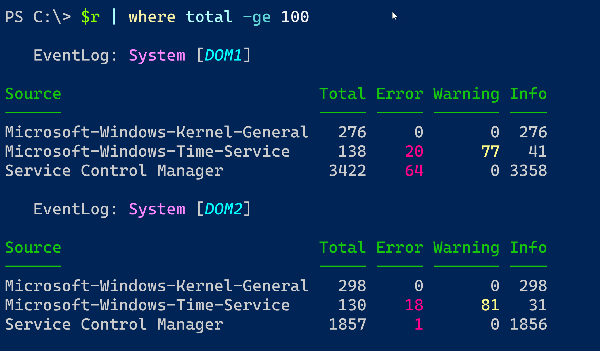
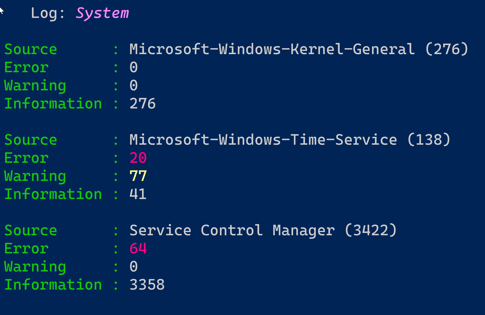

# PowerShell Toolmaking Live!

These are the files I created in my live toolmaking session. I eventually got the remoting piece to work and that is in the updated version of `Get-WineventRport.ps1`.

The ps1 file and ps1xml files need to be in the same directory.

```powershell
#dot source the ps1 file
PS C:\. <path to the files>\get-wineventreport.ps1
PS C:\> $r = Get-WinEventReport -LogName system -ComputerName dom1,dom2 -Credential company\artd
```



I also added a default list view.

```powershell
PS C:\> $r | where {$_.total -ge 100 -AND $_.Computername -eq 'Dom1'} | format-list
```



You can install [PSScriptTools](https://github.com/jdhitsolutions/PSScriptTools) from the PowerShell Gallery to get the `New-PSFormatXML` and `Show-ANSISequence` functions.

You can find all of my professional and online resources at [https://jdhitsolutions.github.io](https://jdhitsolutions.github.io).

Thank you for your interest.
